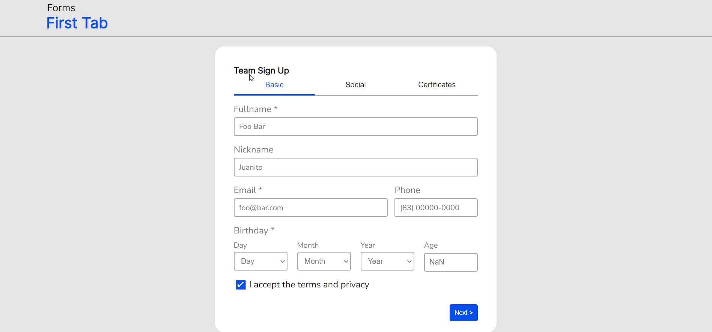
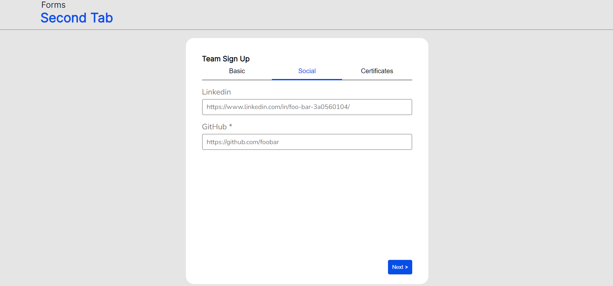
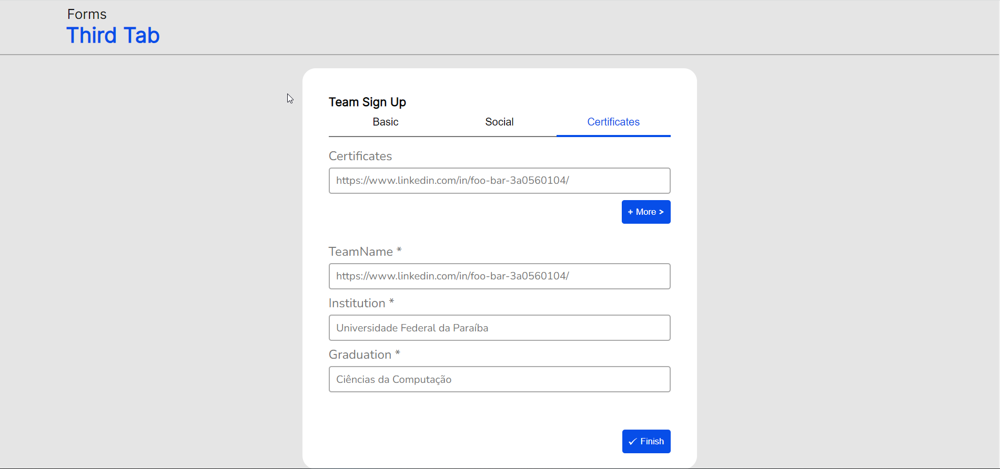

# Desafio Sprint 4 | Programa de Bolsas | Compass.UOL

- [Visão Geral](#visão-geral)
  - [Desafio](#desafio)
  - [Screenshots](#screenshot)
  - [Links](#links)
- [Processo](#processo)
  - [Construido com](#construido-com)
- [Validações](#validações)
- [Autor](#autor)

## Visão Geral

### Desafio

Construir uma tela de cadastro para funcionários, onde podem ser adicionados dados obrigatórios como: nome, email, aniversário, GitHub, nome do time, instituição de ensino e graduação, e campos opcionais como certificados conquistados e linkedin.<br/>
O mesmo também possui avisos caso alguma informação, necessária, não seja preenchida corretamente.<br/>
Depois de preecher corretamente todos os campos, o usuário é direcionado a página "Sucess" onde será mostrado todos os dados que foram preenchidos pelo mesmo.

### Screenshot
<div align="center">
    
    
    
</div>

### Links

- Solução: [Repositório GitHub](https://github.com/joaoatreto27/sprint4_compass)
- Deploy: [Deploy](https://sprint-4-squad-red.netlify.app/)

### Construido com

- HTML5
- CSS
- Flexbox
- Vue.JS
- Sass


### Validações

- Fullname: Primeira letar maiúscula, no mínimo duas letras em cada palavra e no mínimo um espaço entre duas palavras;
- Email: Pelo menos uma letra antes de um @, um letra depois do @ e uma letra depois de um ponto (.);
- Bithday: Selecionar uma opção em cada input(Day, Month e Year);
- GitHub: Necessita ser um link;
- TeamName: Necessita ser um link;
- Institution: Somente ser preenchido;
- Graduation: Somente ser preenchido;


## Autor

- Linkedin - [João Antonio Treto](https://www.linkedin.com/in/joaoatreto-159727213/)

## Project setup
```
npm install
```

### Compiles and hot-reloads for development
```
npm run serve
```

### Compiles and minifies for production
```
npm run build
```

### Run your unit tests
```
npm run test:unit
```

### Lints and fixes files
```
npm run lint
```

### Customize configuration
See [Configuration Reference](https://cli.vuejs.org/config/).
